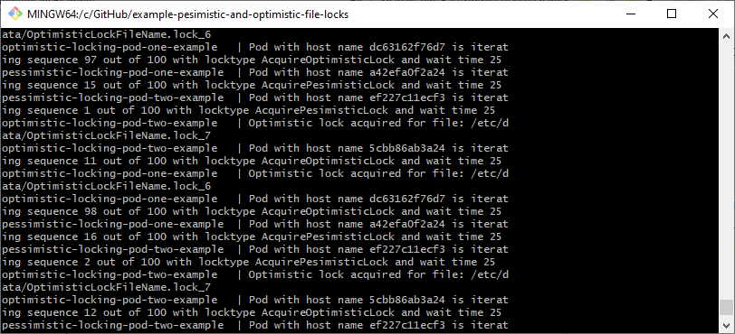
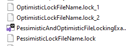

# What it is about ?
 An example how to use pessimistic and optimistic file locks on a shared file system storage in distributed systems. This example shows of possible ways, but it can be achieved a bit differently too.

 More read on [Wikipedia](https://en.wikipedia.org/wiki/Lock_(computer_science))

 # Requirements to launch solution

 1. You need docker desktop for Windows. [Download here](https://www.docker.com/products/docker-desktop/)
 2. .NET Core 6 LTS [Download here](https://dotnet.microsoft.com/en-us/download/dotnet/6.0)

# Launch with docker compose

```
docker-compose up --build
```

# Result examples

## Console output


## File system locks examples


# Pessimistic locking

## Description

 It is a mechanism when only one thread, pod, service aquires an exclusive lock on a shared resource (in this example shared resource is a file). 
 Who takes the lock it becomes a leader to continue with a process to do some actions.
 In file system file name can only be unique. 
 By this uniqueness it is not hard to use a shared file system storage, 
 because which process creates a file with expected unique name, wins to continue to work on.
 Other processes who trying to acquire a lock on a resource ideally should get an information exception or error to act on. 
 When the process is finished lock is released (e.g. file can be deleted and etc.).

## Others examples to achieve pessimistic locking ?

 For example in SQL database you can achieve an exclusive lock with *`sp_getapplock`* 
 and release the lock with *`sp_releaseapplock`*. 

 More to read - [MSDN Docs](https://learn.microsoft.com/en-us/sql/relational-databases/system-stored-procedures/sp-getapplock-transact-sql?view=sql-server-ver16)

# Optimistic locking

## Description

 It is a mechanism when exclusive locks is not acquired, but processes still can continue to run and do other work.
 In this scenario usually no hard error should occur. 
 In code this scenario is achieved by checking if a file already exists, if not file is created.
 As mentioned in pessimistic locking file is unique, but upon an existance of a file check error is not thrown. Optimistic locks can be achieved by file versioning too.
  
## Others examples to achieve optimistic locking ?

 Other of the ways you can track a record in a database  with a version of it. Meaning you can have a Primary Key concept on two fields `Id` and `Version`.
 Multiple processes can take a record, do some logic and increment a version by 1. 
 Both processes will try to commit the transaction and one of the transaction will fail with unique constraint error, because Primary Key is unique.
 Then client can choose how to act on this situation.

 More to read - [MSDN Docs](https://learn.microsoft.com/en-us/dotnet/framework/data/adonet/optimistic-concurrency)
